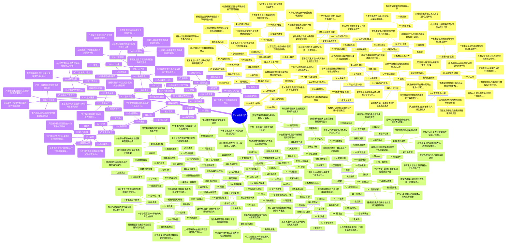

```mermaid
mindmap
    root((医林独啸斋方阵))
      外感病阵
        B1.表层·太阳
          C1.单纯表证
            D1.汗法·辛温
              ✅ 桂枝汤 (桂枝汤专题覆杯而愈医案三则)
              📝 麻黄汤
              ✅ 葛根汤 (小儿恶寒发热服葛根汤体温不降反升全面...)
              ✅ 荆防败毒散 (荆防败毒散专题三年来反复发作的湿疹瘙...)
              ✅ 人参败毒散 (人参败毒散方证虚人感染新冠瘟疫速服此...)
            D2.汗法·辛凉
              📝 银翘散
              ✅ 桑菊饮 (调胃桑菊饮小孩因肺热而发烧多日不退咳...)
              📝 葱豉汤
              ✅ 调胃桑菊饮 (调胃桑菊饮小孩因肺热而发烧多日不退咳...)
          C2.外感夹湿
            D3.汗法+化湿·寒湿
              📝 麻黄加术汤
              ✅ 桂枝加苓术附汤 (桂枝加苓术附汤专题阴证外感一诊速愈医...)
              ✅ 新定白术汤 (新定白术汤专题用古经方思维分析新定白...)
              📝 近效术附汤
            D4.汗法+化湿·湿热
              ✅ 麻杏苡甘汤 (小儿甲流后两腿疼痛无力走不动路麻杏苡...)
              ✅ 越婢加术汤 (越婢加术汤专题淋证解表速愈案)
            D5.汗法+化湿·水饮
              📝 小青龙汤
              📝 小青龙加石膏汤
            D6.和法+化湿·通用
              ✅ 藿香正气散 (藿香正气散方证外解风寒内化寒湿之高效...)
              ✅ 参苏饮 (参苏饮专题脾胃虚兼有外感咳嗽之高效方)
              ✅ 参苏止嗽散 (老人流感高烧后剧烈咳嗽食欲全无疲劳乏...)
              ✅ 杏苏散 (转被我误诊的秋季凉燥杏苏散效如桴鼓蒿...)
          C3.外感夹郁热
            D7.清宣郁热·温病
              ✅ 升降散 (小孩发烧燥热口渴欲呕升降散与三豆饮完...)
              📝 辛凉三味
              ✅ 柴葛解肌汤 (熬夜加班后二次感染新冠柴葛解肌汤一剂...)
              ✅ 柴葛升降散 (流感高烧392柴葛升降散一剂退烧两剂...)
              ✅ 柴葛芩连汤 (二阳发烧38腹泻燥热柴葛芩连汤一剂速...)
            D8.清宣郁热·火郁
              ✅ 清上蠲痛汤 (清上蠲痛汤方证善治各类头痛的神效方)
              ✅ 清解汤 (流感季突然发烧全身灼热前额痛面热如醉...)
              ✅ 寒解汤 (寒解汤专题小朋友高烧392一剂退热三...)
              ✅ 升麻鳖甲汤 (流感发烧咽喉灼热痛升麻鳖甲汤有良效)
              ✅ 麻黄升麻汤 (二阳发热389咽喉热痛麻黄升麻汤半剂...)
            D9.透邪外出·瘟疫
              ✅ 五根汤 (一家老小感染甲流高烧咽痛柴胡五根汤一...)
              ✅ 柴胡五根汤 (一家老小感染甲流高烧咽痛柴胡五根汤一...)
              ✅ 二加柴苓汤 (二加柴苓汤新冠甲乙流支原体肺炎疫情中...)
          C4.外感夹正虚
            D10.扶正解表·气虚
              ✅ 人参败毒散 (人参败毒散方证虚人感染新冠瘟疫速服此...)
              ✅ 参苏饮 (参苏饮专题脾胃虚兼有外感咳嗽之高效方)
            D11.扶正解表·阳虚
              📝 麻黄附子细辛汤
              ✅ 再造散 (再造散专题经方思维解析再造散方证)
              ✅ 大青龙加附子汤 (一岁小孩高烧392伴抽动大青龙加附子...)
              ✅ 桂枝加苓术附汤 (桂枝加苓术附汤专题阴证外感一诊速愈医...)
            D12.扶正解表·阴虚
              📝 加减葳蕤汤
          C5.外感夹瘀血
            D13.解表+活血
              📝 桂枝茯苓丸合方
          C6.外感后期
            D14.止咳化痰
              ✅ 止嗽散 (止嗽散方证广泛治疗各类外感咳嗽高效方)
              ✅ 前胡止嗽汤 (两兄妹咳嗽不止月余前胡止嗽汤一剂知二...)
              ⚪ 半夏止嗽汤
              ✅ 桔梗元参汤 (反复鼻塞流涕屡用升散解表药无效桔梗元...)
            D15.利咽
              ✅ 喉科六味汤 (神奇的喉科六味汤咽痒咳嗽不止扁桃体肿...)
              ✅ 玄参利咽汤 (咽中干痒咳嗽咽部多年痰堵感咳之不出咽...)
            D16.退热
              ✅ 三仁汤 (女孩甲流反复发烧咳嗽剧烈柴胡三仁汤1...)
              📝 柴胡加石膏汤
        B2.半表半里·少阳
          C7.少阳本证
            D17.和解少阳
              ✅ 小柴胡汤 (转小柴胡汤三用耳病颈肩痛白带)
              ✅ 柴胡枳桔汤 (反复发烧一周自觉胸中满闷堵塞麻黄升麻...)
              ⚪ 柴胡加芒硝汤
          C8.少阳夹湿
            D18.柴胡+化湿
              ✅ 柴胡三仁汤 (女孩甲流反复发烧咳嗽剧烈柴胡三仁汤1...)
              📝 柴胡达原饮
              ✅ 达原饮 (76岁老人大白肺75肺受累柴苓达原饮...)
              ✅ 柴苓达原饮 (76岁老人大白肺75肺受累柴苓达原饮...)
              ✅ 柴苓汤 (二加柴苓汤新冠甲乙流支原体肺炎疫情中...)
            D19.柴胡+分消
              ✅ 柴胡桂枝干姜汤 (牛皮癣反复发作多年柴胡桂枝干姜汤有良...)
              ✅ 柴桂姜合归芍散 (柴桂姜合归芍散专题全身关节疼痛怕冷皮...)
          C9.少阳阳明合病
            D20.和解+清下
              ✅ 大柴胡汤 (阑尾炎发作腹痛难忍浑身冷汗恶心呕吐大...)
              ✅ 柴胡加龙骨牡蛎汤 (月经期被惊吓后失眠心慌柴胡加龙骨牡蛎...)
        B3.里层·阳明
          C10.阳明热盛
            D21.清气分热
              📝 白虎汤
              📝 白虎加人参汤
          C11.阳明腑实
            D22.攻下热结
              📝 大承气汤
              📝 小承气汤
              📝 调胃承气汤
          C12.阳明湿热
            D23.清利湿热
              📝 茵陈蒿汤
              ✅ 茵陈五苓散 (过节饮酒过多损伤身体茵陈五苓散颇有效)
              📝 栀子大黄汤
              ✅ 易黄汤 (易黄汤不止治妇科更是治疗下肢皮肤瘙痒...)
      内伤病阵
        B4.中焦·脾胃
          C13.脾胃气虚
            D24.补中益气
              ✅ 补中益气汤 (新冠后闭经三个月补中益气汤两诊愈)
              📝 四君子汤
              📝 参苓白术散
              ✅ 清暑益气汤 (清暑益气汤专题老人新冠后中耳炎耳鸣耳...)
            D25.升阳举陷
              ✅ 升陷汤 (升陷汤专题经方思维讲透张锡纯升陷五方...)
              ✅ 升陷五方 (升陷汤专题经方思维讲透张锡纯升陷五方...)
              ✅ 培脾舒肝汤 (小女孩胸闷喘息短气张锡纯培脾舒肝汤一...)
              ✅ 安冲汤 (安冲汤专题张锡纯治月经淋漓不止之神效...)
              ✅ 升阳益胃汤 (产后一身是病升阳益胃汤两月痊愈)
          C14.脾胃虚寒
            D26.温中散寒
              📝 理中汤
              📝 理中丸
              📝 附子理中汤
              📝 吴茱萸汤
              📝 大建中汤
            D27.温阳化饮
              ✅ 苓桂术甘汤 (一剂苓桂术甘汤下去手足回温腹部振水音...)
              📝 茯苓饮
              ✅ 理饮汤 (理饮汤扶阳祛寒驱逐胸膈中一切寒饮之良...)
              ⚪ 苓姜术甘汤
          C15.脾胃湿热
            D28.燥湿运脾
              ✅ 平胃散 (平胃散方证经方思维解析这张燥湿顺气开...)
              ✅ 香砂养胃丸 (香砂养胃丸巧治老胃病医案两则)
            D29.清化湿热
              ✅ 三仁汤 (女孩甲流反复发烧咳嗽剧烈柴胡三仁汤1...)
              📝 藿朴夏苓汤
              📝 甘露消毒丹
              ✅ 蒿芩清胆汤 (转被我误诊的秋季凉燥杏苏散效如桴鼓蒿...)
              ✅ 温胆汤 (温胆汤专题心烦失眠6剂愈)
          C16.中焦痞证
            D30.辛开苦降
              ✅ 半夏泻心汤 (半夏泻心汤专题多年老胃病一诊速效医案)
              📝 生姜泻心汤
              ✅ 甘草泻心汤 (甘草泻心汤专题全身丘疹瘙痒难忍5剂速...)
              📝 附子泻心汤
              📝 黄连汤
              📝 旋覆代赭汤
        B5.下焦·肾膀胱
          C17.阳虚水泛
            D31.温阳利水
              ✅ 真武汤 (90岁老人大便不通百法不效真武汤扶阳...)
              ✅ 附子汤 (一岁小孩高烧392伴抽动大青龙加附子...)
              ✅ 五苓散 (转口角炎反复发作口唇起皮发炎五苓散加...)
              ✅ 猪苓汤 (理血猪苓汤速愈新冠后尿血两例)
          C18.阳虚寒凝
            D32.温阳散寒
              📝 四逆汤
              📝 通脉四逆汤
              ⚪ 白通汤
              📝 当归四逆汤
            D33.温潜阳根
              ✅ 潜阳丹 (小伙子中邪精神失常躁狂我用潜阳丹治愈)
              ✅ 封髓丹 (潜阳封髓丹专题牙痛流血两剂愈医案)
              ✅ 潜阳封髓丹 (潜阳封髓丹专题牙痛流血两剂愈医案)
              ✅ 引火汤 (老人牙疼右侧淋巴脖子疼引火汤配合牙痛...)
          C19.肾阴虚
            D34.滋阴补肾
              📝 六味地黄丸
              📝 麦味地黄丸
              📝 知柏地黄丸
              ✅ 肾气丸 (下肢动脉硬化腿软走路无力健步肾气丸两...)
              📝 麦门冬汤
          C20.肾阳虚补
            D35.补肾助阳
              ✅ 肾气丸 (下肢动脉硬化腿软走路无力健步肾气丸两...)
              📝 金匮肾气丸
              ⚪ 右归饮
              📝 还少丹
        B6.上焦·心肺
          C21.心阳虚
            D36.温通心阳
              📝 桂枝甘草汤
              📝 桂枝去芍药汤
              📝 桂枝去芍药加附子汤
              ✅ 苓桂术甘汤 (一剂苓桂术甘汤下去手足回温腹部振水音...)
          C22.胸阳不振
            D37.通阳宣痹
              📝 瓜蒌薤白白酒汤
              📝 瓜蒌薤白半夏汤
              📝 枳实薤白桂枝汤
              📝 茯苓杏仁甘草汤
              📝 橘枳姜汤
          C23.心阴虚
            D38.养阴安神
              📝 黄连阿胶汤
              📝 百合地黄汤
              ⚪ 百合鸡子汤
              📝 百合知母汤
          C24.肺系疾病
            D39.止咳化痰·寒
              ✅ 止嗽散 (止嗽散方证广泛治疗各类外感咳嗽高效方)
              📝 苓甘五味姜辛汤
              📝 射干麻黄汤
            D40.止咳化痰·热
              📝 麻杏石甘汤
              📝 苇茎汤
              📝 葶苈大枣泻肺汤
        B7.肝胆
          C25.肝郁
            D41.疏肝解郁
              ✅ 四逆散 (小儿六岁仍旧尿床四逆散三剂大效十剂治...)
              📝 柴胡疏肝散
              ✅ 逍遥散 (腰痛逍遥散专题用古经方思维分析腰痛逍...)
              ✅ 腰痛逍遥散 (腰痛逍遥散专题用古经方思维分析腰痛逍...)
            D42.清肝泻火
              ⚪ 清肝引火汤
              📝 龙胆泻肝汤
          C26.肝阳上亢
            D43.平肝潜阳
              📝 天麻钩藤饮
              📝 建瓴汤
              📝 镇肝熄风汤
          C27.肝风
            D44.息风止痉
              ✅ 侯氏黑散 (侯氏黑散专题持续两年不愈的头部胀痛案)
              📝 风引汤
              ⚪ 大定风珠
          C28.寒热错杂
            D45.乌梅丸法
              📝 乌梅丸
              ✅ 麻黄升麻汤 (二阳发热389咽喉热痛麻黄升麻汤半剂...)
              📝 干姜黄芩黄连人参汤
        B8.瘀血
          C29.瘀血证
            D46.轻·活血
              📝 桂枝茯苓丸
              ✅ 身痛逐瘀汤 (外伤致腰部屈伸不利十五年身痛逐瘀汤两...)
              📝 散偏汤
            D47.中·破瘀
              📝 血府逐瘀汤
              📝 桃核承气汤
              📝 抵挡汤
              ⚪ 下瘀血汤
            D48.重·消癥
              ⚪ 大黄蟅虫丸
              📝 鳖甲煎丸
            D49.妇科·温经
              📝 温经汤
              ✅ 黄土汤 (恶露不止两个月多方求医无效我用黄土汤...)
              📝 生化汤
              📝 胶艾汤
        B9.痹证
          C30.痹证
            D50.寒湿痹
              📝 桂枝芍药知母汤
              ⚪ 乌头汤
              📝 甘草附子汤
              ✅ 附子汤 (一岁小孩高烧392伴抽动大青龙加附子...)
            D51.湿热痹
              📝 白虎加桂枝汤
              ✅ 宣痹汤 (转被我误诊的秋季凉燥杏苏散效如桴鼓蒿...)
              ✅ 上焦宣痹汤 (转被我误诊的秋季凉燥杏苏散效如桴鼓蒿...)
            D52.虚痹
              📝 黄芪桂枝五物汤
              ✅ 大防风汤 (大防风汤专题大补气血而流通之治关节疼...)
              ✅ 加味黄芪五物汤 (加味黄芪五物汤专题经方思维解析张锡纯...)
            D53.痰瘀痹
              ✅ 二朮汤 (二朮汤专题从古经方药证思维分析二朮汤...)
              ✅ 身痛逐瘀汤 (外伤致腰部屈伸不利十五年身痛逐瘀汤两...)
        B10.外科·皮肤病
          C31.痈脓
            D54.清热解毒
              📝 苇茎汤
              ✅ 五味消毒饮 (脸部大量疔疮脓包服中药后脓包消退皮肤...)
              📝 仙方活命饮
              ✅ 皮肤解毒汤 (男子面部青斑腹胀皮肤解毒汤合平胃散效...)
          C32.疮疡
            D55.辛凉透邪
              📝 荆芥败毒散
              ✅ 清热消风散 (中耳炎流脓水一年清热消风散三剂彻底治...)
              ✅ 除涕止痒汤 (除涕止痒汤专题从古经方药证思维分析自...)
      特殊病机阵
        B11.合方阵式
          C33.经方合方
            D56.柴胡系合方
              ✅ 柴胡桂枝汤 (甲流发烧数日不退柴胡桂枝汤两剂治愈)
              ✅ 柴胡桂枝干姜汤 (牛皮癣反复发作多年柴胡桂枝干姜汤有良...)
              ✅ 柴胡加龙骨牡蛎汤 (月经期被惊吓后失眠心慌柴胡加龙骨牡蛎...)
              📝 小柴胡银牛荆豆汤
            D57.活血系合方
              📝 桂枝茯苓丸合方
              📝 桂枝茯苓丸合归芍散
            D58.胸痹系合方
              ⚪ 瓜蒌薤白酒汤合方
          C34.经方+时方
            D59.经时合用
              ✅ 荆防败毒散 (荆防败毒散专题三年来反复发作的湿疹瘙...)
              📝 小柴胡银牛荆豆汤
              📝 三仁汤合方
              ✅ 二朮汤 (二朮汤专题从古经方药证思维分析二朮汤...)
              ⚪ 六味地黄丸合方
          C35.寒温并用
            D60.温凉并行
              ✅ 大青龙加附子汤 (一岁小孩高烧392伴抽动大青龙加附子...)
              ✅ 柴胡枳桔汤 (反复发烧一周自觉胸中满闷堵塞麻黄升麻...)
              📝 五苓散合方
              ✅ 麻黄升麻汤 (二阳发热389咽喉热痛麻黄升麻汤半剂...)
          C36.攻补兼施
            D61.扶正祛邪
              ⚪ 补中益气汤合方
              ✅ 升阳益胃汤 (产后一身是病升阳益胃汤两月痊愈)
              ✅ 参苏止嗽散 (老人流感高烧后剧烈咳嗽食欲全无疲劳乏...)
              ✅ 人参败毒散 (人参败毒散方证虚人感染新冠瘟疫速服此...)
              ✅ 桂枝加苓术附汤 (桂枝加苓术附汤专题阴证外感一诊速愈医...)
        B12.急危重症
          C37.阳脱
            D62.回阳救逆
              📝 四逆汤
              📝 通脉四逆汤
              📝 破格救心汤
              ⚪ 参附汤
          C38.阴脱
            D63.救阴固脱
              📝 生脉散
              📝 炙甘草汤
          C39.热入血室
            D64.刺期门+凉血
              ⚪ 刺期门
              ✅ 小柴胡汤 (转小柴胡汤三用耳病颈肩痛白带)
              📝 桃核承气汤
        B13.妇科
          C40.月经不调
            D65.调经
              📝 温经汤
              📝 桂枝茯苓丸
              📝 当归芍药散
              ✅ 归芪建中汤 (产后身体极虚弱腰酸怕冷归芪建中汤有神...)
              ✅ 当归建中汤 (当归建中汤专题妇科病调经补血祛瘀良方...)
              ✅ 小建中汤 (小孩过敏性鼻炎鼻塞流涕耳朵痒皮肤痒小...)
              📝 黄芪建中汤
              ✅ 易黄汤 (易黄汤不止治妇科更是治疗下肢皮肤瘙痒...)
            D66.痛经
              📝 桂枝茯苓丸
              📝 当归芍药散
            D67.闭经
              ⚪ 大黄蟅虫丸
              📝 抵当汤
        B14.儿科
          C41.儿科外感
            D68.小儿退热
              ✅ 五根汤 (一家老小感染甲流高烧咽痛柴胡五根汤一...)
              ✅ 三豆饮 (小儿反复高烧40精神倦怠三豆饮加味一...)
              ✅ 二加柴苓汤 (二加柴苓汤新冠甲乙流支原体肺炎疫情中...)
              ✅ 柴胡五根汤 (一家老小感染甲流高烧咽痛柴胡五根汤一...)
            D69.小儿咳嗽
              📝 二陈汤
              📝 三仁汤合方
            D70.小儿痘疹
              ✅ 升麻鳖甲汤 (流感发烧咽喉灼热痛升麻鳖甲汤有良效)
              ✅ 麻黄升麻汤 (二阳发热389咽喉热痛麻黄升麻汤半剂...)
```